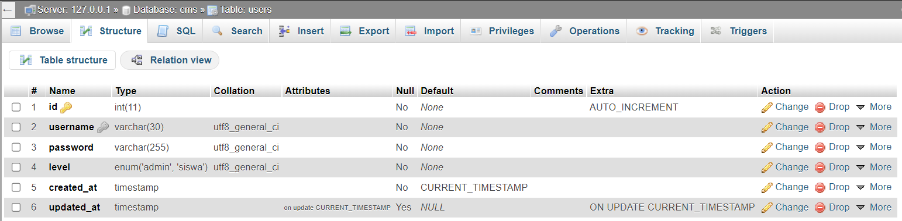
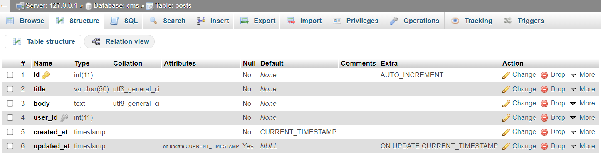
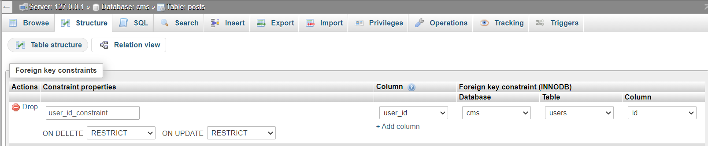

# _Database_

## a. Membuat _database_

1. Buatlah database bernama `cms`
2. Buatlah table `users` dengan structure seperti berikut ini:

    a. Set `AUTO_INCREMENT` untuk kolom `id` 
    b. Set `UNIQUE` untuk kolom `username` 
    c. Set kolom `created_at` agar nilai _default_-nya `CURRENT_TIMESTAMP` 
    d. Set kolom `updated_at` agar nilai _default_-nya `NULL` 
    e. Set `on update CURRENT_TIMESTAMP` untuk kolom `updated_at` 
3. Buatlah table `posts` dengan structure seperti berikut ini:

    a. Set `AUTO_INCREMENT` untuk kolom `id` 
    b. Set kolom `created_at` agar nilai _default_-nya `CURRENT_TIMESTAMP` 
    c. Set kolom `updated_at` agar nilai _default_-nya `NULL` 
    d. Set `on update CURRENT_TIMESTAMP` untuk kolom `updated_at` 
4. Atur _relationship_ antara table `posts` dan `users`
