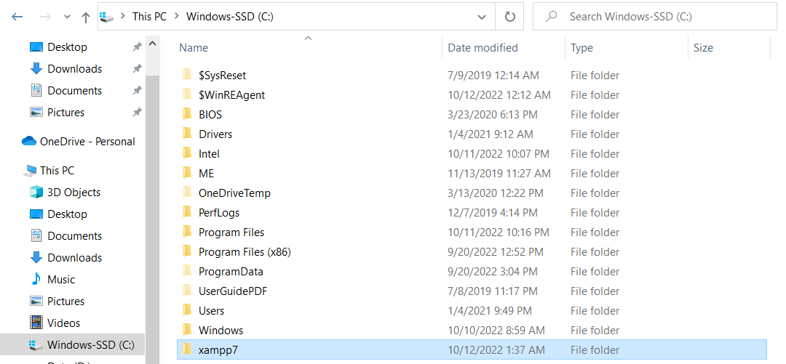
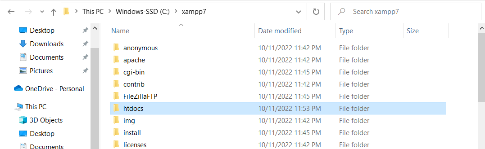
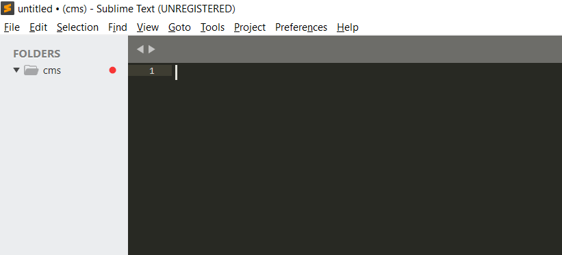
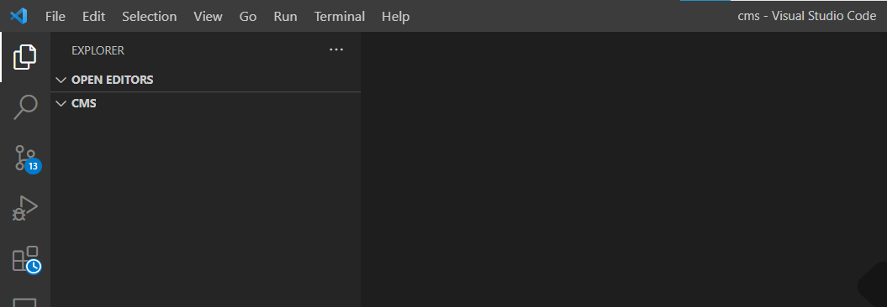
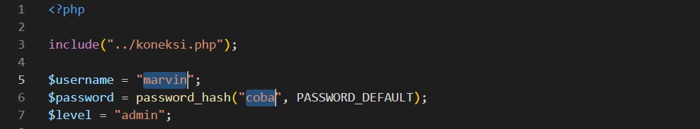
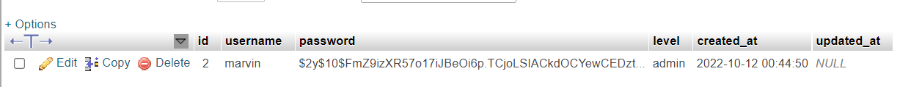
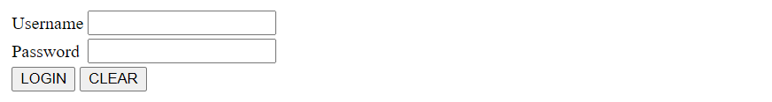
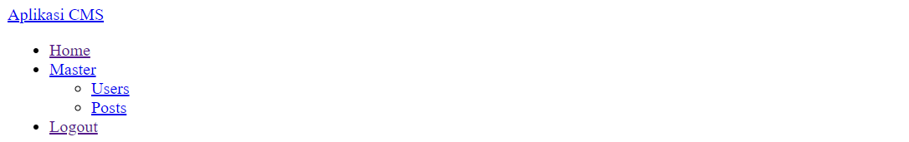

# _Login and Logout_

## _Coding_

1. Buka *folder lokasi instal XAMPP* (biasanya di `C:\xampp`, bisa berbeda-beda tiap komputer)

2. Buka folder `htdocs`

3. Buat folder `cms` di dalam `htdocs`
4. Buka text editor (Visual Studio Code _atau_ Sublime Text)
5. Buka folder `cms` menggunakan _text editor_

6. Buat file-file berikut di folder `cms` mengikuti contoh di Github: 
    i. `koneksi.php` 
    ii. `login.php` 
    iii. `validasi.php` 
    iv. `session.php`, `navbar.php`, `index.php` 
    v. `logout.php`

## _Testing_

### Membuat user baru
1. Buat file `create_user.php` di folder `cms`, sesuai contoh di Github (folder `utilities`)
2. Edit bagian `$username` dan `$password` dengan username dan password sesuai keinginan

3. Buka browser (Google Chrome, Edge, atau Firefox)
4. Buka alamat http://localhost/cms/create_user.php
5. Cek table `users` di phpmyadmin, seharusnya ada 1 data yang tersimpan

### Tes login dan logout
1. Buka alamat http://localhost/cms/login.php

2. Masukkan username dan password yang sudah tersimpan di phpmyadmin
3. Tekan Login. 
(_Note_: seharusnya akan muncul halaman `index.php`)

4. Tekan Logout. 
(_Note_: seharusnya akan kembali ke halaman `login.php`)
5. Untuk tes keamanan, coba buka alamat http://localhost/cms/index.php setelah logout. 
(_Note_: Website yang aman, seharusnya tidak akan bisa membuka halaman `index.php` setelah logout.)