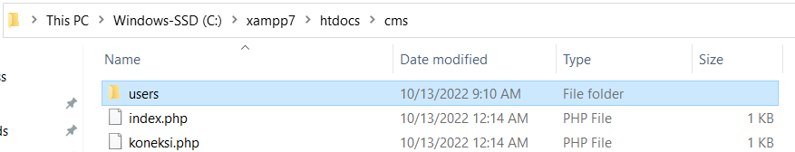
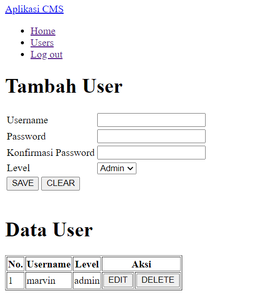
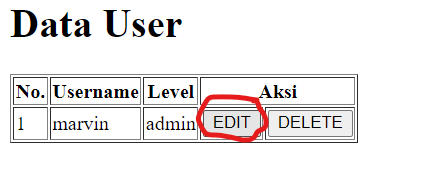
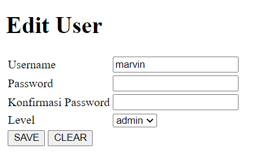

# _CRUD User_

## Cek Ulang Fitur Login

1. Buka folder `cms` yang sudah dibuat di tutorial [1_login_and_logout](../1_login_and_logout)
2. Cek ulang file-file berikut ini sambil melakukan testing: 
    i. `koneksi.php` 
    ii. `login.php` 
    iii. `validasi.php` 
    iv. `session.php` 
    v. `navbar.php` 
    vi. `index.php` 
    vii. `logout.php`

## Fitur 'Melihat Daftar User'

1. Buat folder `users` di dalam folder `cms`

2. Buat file-file berikut ini di folder `users` mengikuti contoh di Github: 
    i. `index.php`

### _Testing_

1. Buka alamat http://localhost/cms/users/index.php, akan muncul tampilan berikut ini: 

2. Klik link Users di menu, seharusnya akan muncul tampilan yang sama

## Fitur 'Memasukkan Data User'

1. Buat file-file berikut ini di folder `users` mengikuti contoh di Github: 
    i. `create.php`

### _Testing_

1. Buka halaman yang menampilkan data user, lalu isi formulir di bagian **Tambah User**
2. Tekan tombol SAVE
3. Data yang baru seharusnya muncul di bagian **Data User**

## Fitur 'Mengubah Data User'

1. Buat file-file berikut ini di folder `users` mengikuti contoh di Github: 
    i. `edit.php` 
    ii. `update.php`

### _Testing_

1. Buka halaman yang menampilkan data user, lalu klik tombol EDIT di salah satu baris data 

2. Coba ubah formulir di bagian **Edit User**, lalu tekan SAVE 

3. Data yang telah diubah seharusnya muncul di bagian **Data User**

## Fitur 'Menghapus Data User'

1. Buat file-file berikut ini di folder `users` mengikuti contoh di Github: 
    i. `delete.php`

### _Testing_

1. Buka halaman yang menampilkan data user, lalu klik tombol DELETE di salah satu baris data 
2. User yang dihapus akan hilang dari **Data User**
3. Jika user yang dihapus sedang login, seharusnya muncul "User sedang aktif"
