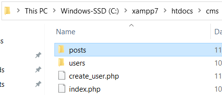
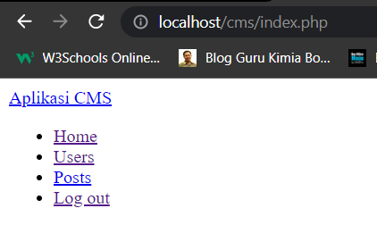
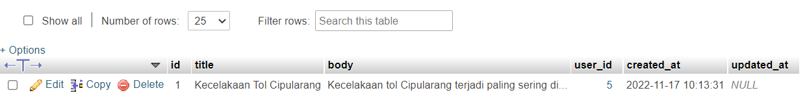
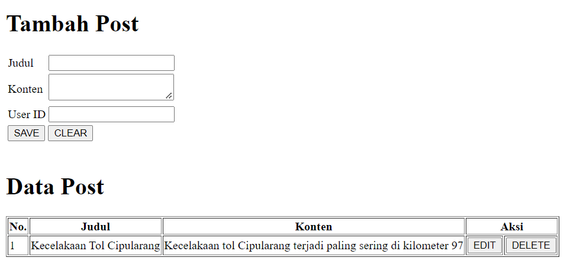

# _CRUD Post_

## Cek Ulang Fitur CRUD User

1. Buka folder `cms`, lalu folder `users` yang sudah dibuat di tutorial [2_crud_user](../2_crud_user)
2. Cek ulang semua fitur ini: 
    i. Login
    ii. Logout
    iii. Lihat data user
    iv. Tambah data user
    v. Ubah data user
    vi. Hapus data user

## Fitur 'Melihat Daftar Post'

1. Buat folder `posts` di dalam folder `cms`

2. Tambah Posts ke dalam `navbar.php`, sehingga muncul seperti ini

3. Buka phpmyadmin, lalu isi table `posts` dengan 1 baris data bebas

4. Salin file `index.php` dari folder `users` ke dalam folder `posts`
5. Ubah isi `index.php` dalam folder `posts`, agar bisa menampilkan data berikut ini

